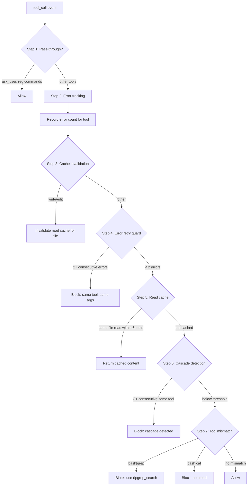

# Agent Harness

**Stop token waste before it happens.** Runtime tool call validation that redirects wrong tool usage, prevents error loops, blocks tool cascades, and caches redundant reads — all before the call reaches the LLM.

## Why

Every incorrect tool call costs tokens. Every error loop burns context window. Every redundant read repeats work. Agent Harness intercepts these patterns at the tool call boundary and blocks them before they execute.

**What it saves:**
- `bash | grep` → redirected to `ripgrep_search` (faster, structured, cached)
- `bash cat` / `head` / `tail` → redirected to `read` (avoids spawning subshells)
- Error retry loops → blocked after 2 consecutive errors on same tool
- Same-tool cascades → 8+ consecutive `bash` calls are blocked with batching suggestion
- Redundant reads → same file read within 6 turns returns cached result

Plus deterministic read caching across turns — re-reading the same file returns cached content without re-executing.

## How it works

Agent Harness hooks into pi's `tool_call` event and runs every call through a 7-step validation pipeline before execution:

1. **Pass-through check** — Tools like `ask_user` pass through immediately (no validation overhead)
2. **Error tracking** — Failed calls are recorded; after 2+ errors on same tool, further calls are blocked
3. **Cache invalidation** — `write`/`edit` or file-modifying `bash` clears the read cache
4. **Error retry guard** — If the same tool errored ≥2 times, subsequent calls are blocked with redirect suggestion
5. **Read cache** — Same path+offset+limit returns cached result (6-turn TTL, bypassed in non-TUI modes)
6. **Cascade detection** — 8+ consecutive calls to the same tool triggers block with batching suggestion
7. **Tool mismatch** — `bash | grep` → `ripgrep_search`, `bash cat` → `read`

### Configuration

- Default rules are built-in; override via `.pi/harness-config.json`
- Per-tool thresholds configurable (`cascadeThreshold`, `passThrough`)
- Loaded per-session, `/reload` picks up changes

## Install

Part of Cheasee-Pi monorepo. Activated automatically when the extension directory is present.

## Requirements

- Pi Coding Agent ≥ 0.79.1 (for `isProjectTrusted`)
- No external dependencies

## Details

### Architecture

```
├── index.ts                  # Entry: session_start/tool_call/turn_start hooks, AgentHarness
├── agent-harness.ts          # AgentHarness class: handleToolCall, 7-step decision tree
├── lib/
│   ├── harness-rules.ts      # Rule definitions: cascade thresholds, pass-through tools, mismatches
│   ├── harness-state.ts      # Error tracking, cascade counter, read cache, turn tracking
│   ├── bash-command.ts       # Tokenize, classify, detect tool mismatches (grep/cat/hexdump)
│   ├── load-config.ts        # Load harness config from .pi/harness-config.json
│   ├── timed-map.ts          # Generic timed map with TTL-based eviction
│   └── constants.ts          # Default thresholds, tool lists
└── test/                     # Extensive test suite
```

### Validation Pipeline



### Tool Mismatch Detection

| Pattern | Detected By | Redirect To |
|---------|-------------|-------------|
| `bash | grep` | `getBashSubKey()` token analysis | `ripgrep_search` |
| `bash cat` | `getCommandName()` | `read` |
| `bash rg` | `getCommandName()` | `ripgrep_search` |
| `bash xxd`/`bash hexdump` | `getCommandName()` | `bash` with `xxd`? |
| `bash find . -name` | `getCommandName()` | `ripgrep_search` / `bash ls` |

### Key Design Decisions

- **Configurable per-tool thresholds** — `.pi/harness-config.json` allows per-tool `cascadeThreshold` (default 8) and `passThrough` flags.
- **Read caching with 6-turn TTL** — `TimedMap` stores file contents for 6 turns. Cache invalidated on write/edit to same file.
- **Error retry guard caps at 2** — First retry reasonable (transient). Second+ consecutive same-tool same-args blocked. Counter resets on turn_start.
- **Cascade detection resets on turn_start** — Prevents long-running multi-tool sequences from false positives.
- **Pass-through list** — `ask_user`, `ask_user_read`, registered tool registrations, command handlers exempt from validation.
- **Fail-safe defaults** — On config load failure, continues with hardcoded defaults. Never blocks due to config errors.

### Config Format (.pi/harness-config.json)

```json
{
  "tools": {
    "read": { "cascadeThreshold": 6, "passThrough": false },
    "bash": { "cascadeThreshold": 4, "passThrough": false },
    "ask_user": { "passThrough": true }
  }
}
```

## License

MIT
