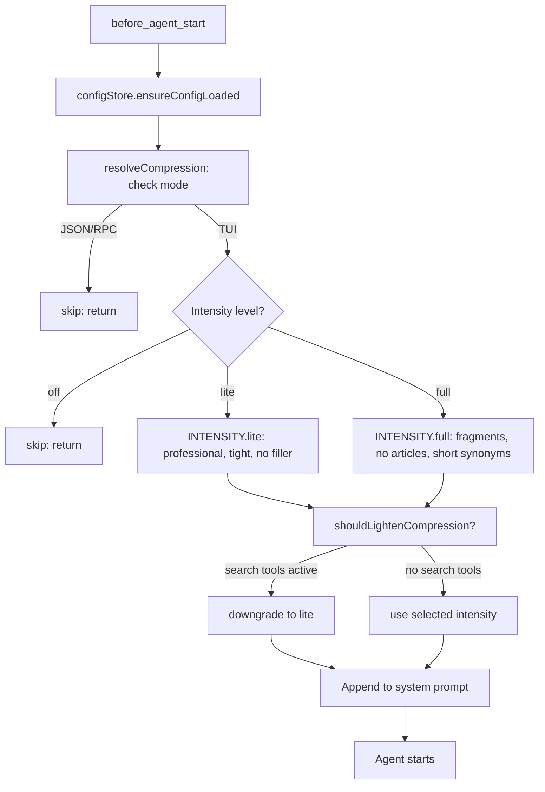

# Caveman Protocol

**Token-efficient AI communication.** Compresses all agent output — strips articles, filler words, pleasantries and hedging — while preserving technical accuracy. Configurable intensity.

## Why

Every response turn costs tokens. Caveman reduces response token count by roughly 30-50% by dropping unnecessary words. Active every session via `AGENTS.md`.

**What it cuts:**
- Articles (a/an/the), filler (just/really/basically/actually/simply)
- Pleasantries (sure/certainly/of course/happy to)
- Hedging (I think/perhaps/maybe/kind of)
- Verbose phrasing ("implement a solution for" → "fix")

Technical terms stay exact. Code blocks unchanged. Errors quoted exact.

## How it works

1. **Config load** — Reads `~/.pi/agent/caveman.json` at session start (or defaults)
2. **Session resolution** — Checks `AGENTS.md` for `{"caveman": "level"}` entry, falls back to config default
3. **Level persistence** — Stored in session entries, survives reload
4. **Mode adaption** — In `json`/`rpc` modes, compression is skipped entirely to avoid mangling structured output
5. **Prompt injection** — `before_agent_start` appends caveman rules to system prompt
6. **Lightening** — If `ripgrep_search`/`structural_search` are active, compression lightens to preserve structured tool output

### Levels

| Level | Effect | Example |
|-------|--------|---------|
| **lite** | Professional, tight. Drop filler only. Full sentences. | "Your component re-renders because you create a new object reference each render. Wrap it in `useMemo`." |
| **full** | Fragments. Drop articles. Short synonyms. | "Bug in auth middleware. Token expiry check uses `<` not `<=`. Fix:" |
| **off** | No compression. Standard verbose style. | |

Cycle with `/caveman` command: lite → full → off → lite.

### Auto-clarity (full level)

Full caveman auto-disables for:
- Security warnings
- Irreversible action confirmations
- Multi-step sequences where fragment clarity risks misread
- User asks to clarify

## Install

Part of Cheasee-Pi monorepo. Activated automatically.

## Requirements

- Pi Coding Agent ≥ 0.78.0
- `AGENTS.md` in project root (activates protocol per session)

## Details

### Architecture

```
├── index.ts        # Entry: lifecycle hooks, command registration
├── config.ts       # ConfigStore: load/save caveman.json, getConfig/setLevel
├── config-ui.ts    # Configuration UI for TUI mode
├── compression.ts  # resolveCompression: intensity selection, mode-aware skip
├── command.ts      # /caveman command handler: cycle levels
├── prompts.ts      # CAVEMAN_BASE + INTENSITY prompt templates
├── types.ts        # Level, CavemanConfig interfaces
└── test/           # Unit tests
```

### Compression Pipeline



### Prompt Injection

BASE (always injected when caveman is on):
```
## Caveman Mode -- Active

IMPORTANT: You are in CAVEMAN MODE. Respond terse like smart caveman.
All technical substance stay. Only fluff die.
...
```

Full intensity adds fragment rules (drop articles, pleasantries, hedging, use short synonyms).

### Key Design Decisions

- **Session level resolution** — Checks `AGENTS.md` for explicit override, then stored config level, then `caveman.json` default, then `"full"` as ultimate fallback.
- **Persistent config** — `~/.pi/agent/caveman.json` stores user preference. `AGENTS.md` overrides per session.
- **Mode awareness** — JSON/RPC modes skip compression entirely. Detected via `ctx.mode`.
- **Tool-aware lightening** — When `ripgrep_search`/`structural_search` in selected tools, compresses at lite only to preserve output structure.
- **Auto-clarity triggers** — Full disabled for security warnings, irreversible actions, ambiguous fragments, user clarify requests.
- **Status indicator** — TUI shows `caveman: FULL` / `caveman: LITE` via `ctx.ui.setStatus()`.
- **Cycle via `/caveman`** — off to full to lite to off.
- **Session level reset on shutdown** — Prevents cross-session bleed.

### Intensity Characteristics

| Aspect | Lite | Full |
|--------|------|------|
| Articles | Kept | Dropped |
| Sentences | Full | Fragments |
| Filler | Dropped | Dropped |
| Pleasantries | Dropped | Dropped |
| Hedging | Dropped | Dropped |
| Synonyms | Normal | Short (big, fix) |
| Code blocks | Unchanged | Unchanged |
| Security warnings | Normal | Auto-clarity |

## License

MIT
